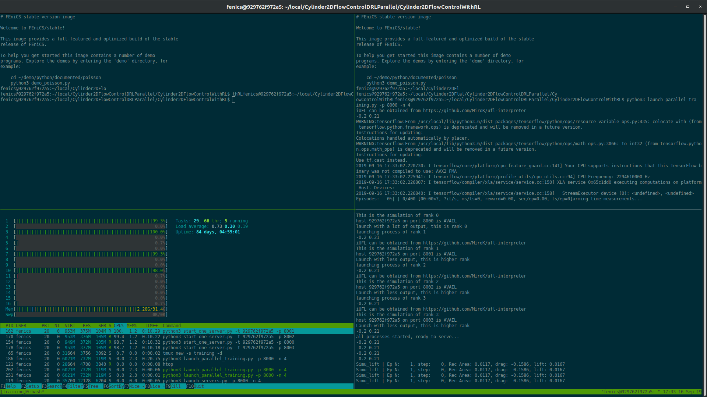

# How to use the docker

On an Ubuntu VM with docker installed, I am able to do the following to run the code:

```
# check docker is available
ubuntu@main-1:~$ sudo docker -v
Docker version 18.06.1-ce, build e68fc7a

# download the image
ubuntu@main-1:~$ wget -4 https://folk.uio.no/jeanra/Informatics/cylinder2dflowcontrol_Parallel_v1.tar 
--2019-09-16 17:25:38--  https://folk.uio.no/jeanra/Informatics/cylinder2dflowcontrol_Parallel_v1.tar
Resolving folk.uio.no (folk.uio.no)... 129.240.121.81
Connecting to folk.uio.no (folk.uio.no)|129.240.121.81|:443... connected.
HTTP request sent, awaiting response... 200 OK
Length: 3759072768 (3.5G) [application/x-tar]
Saving to: ‘cylinder2dflowcontrol_Parallel_v1.tar’

cylinder2dflowcontrol_Parallel_v1.tar    100%[===============================================================================>]   3.50G   282MB/s    in 17s     

2019-09-16 17:25:55 (209 MB/s) - ‘cylinder2dflowcontrol_Parallel_v1.tar’ saved [3759072768/3759072768]

# load the image
ubuntu@main-1:~$ sudo docker load -i cylinder2dflowcontrol_Parallel_v1.tar
Loaded image: v1:latest

# spin a container out of the image and exit
ubuntu@main-1:~$ sudo docker run -ti --name parallel_training v1:latest
# FEniCS stable version image

Welcome to FEniCS/stable!

This image provides a full-featured and optimized build of the stable
release of FEniCS.

To help you get started this image contains a number of demo
programs. Explore the demos by entering the 'demo' directory, for
example:

    cd ~/demo/python/documented/poisson
    python3 demo_poisson.py
fenics@929762f972a5:~$ exit
exit

# start the container in background
ubuntu@main-1:~$ sudo docker start parallel_training
parallel_training

# open a terminal in the container
ubuntu@main-1:~$ sudo docker exec -ti -u fenics parallel_training /bin/bash -l
# FEniCS stable version image

Welcome to FEniCS/stable!

This image provides a full-featured and optimized build of the stable
release of FEniCS.

To help you get started this image contains a number of demo
programs. Explore the demos by entering the 'demo' directory, for
example:

    cd ~/demo/python/documented/poisson
    python3 demo_poisson.py
fenics@929762f972a5:~$ 

# launch a training (here using ports 8000 and following (ie 8000, 8001, 8002 and 8003) for communication with 4 servers
fenics@929762f972a5:~/local/Cylinder2DFlowControlDRLParallel/Cylinder2DFlowControlWithRL$ bash script_launch_parallel.sh training 8000 4
Ports available, launch...
Launching the servers. This takes a few seconds...
Wait 40 secs for servers to start...
Launched training!
```

Now tmux opens after a few seconds, showing good training:


